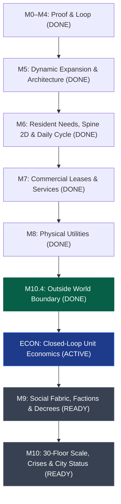

# Roadmap — One Roof

## Overview & Vision Boundary

One Roof is a vertical-city simulation where the player acts as the building manager, called the Steward in the interface. They shape architecture, infrastructure, leases, and policy while autonomous residents form routines, relationships, businesses, and factions ([Game Vision](../Docs/01_GAME_VISION.md)).

- **First Proof (Milestones 0–4):** Five floors, 50 persistent residents, observable elevator congestion, explainable wait overlay, second-elevator capacity intervention, and golden acceptance verification. *(STATUS: COMPLETE)*
- **Interactive Expansion (Milestone 5):** Dynamic slab/room construction, economy treasury, demand-driven leasing, bulldozer demolition, stairwells, 9-sliced room backdrops, interactive camera navigation, environment prop families, holographic build shaders, split presenters, and resident room living. *(STATUS: COMPLETE)*
- **Living Society & Psychology (Milestone 6):** Five core resident needs, personality facets, satisfaction, grievances, strain, scrutiny external pressure, soft specialist roles, Spine 2D modular rig, and 24/7 daily cycle. *(STATUS: COMPLETE)*
- **Commercial Economy & Services (Milestone 7):** Expanded commercial zoning (retail, clinic, workshop, security), lease lifecycle, local hiring, business solvency, foot traffic, and three-car elevator limits. *(STATUS: COMPLETE)*
- **Physical Utilities & Infrastructure (Milestone 8):** Physical electrical grid, plumbing & waste networks, infrastructure degradation, technician repairs, and utilities overlay. *(STATUS: COMPLETE)*
- **Outside World Boundary (Milestone 10.4):** First-class `WorldLocation` endpoint (`Room` / `Outside`), lobby-only street edge routing, layered parallax city skyline, day/night lighting, and demand move-in arrivals. *(STATUS: COMPLETE)*
- **Steward UI Shell:** Compact status card, grouped build palette, mode dock (Build, Inspect, Data, Manage), and overlay selection under `StewardTheme`. *(STATUS: COMPLETE; spatial overlay rendering remains OR-1006)*
- **Unit Economics (ECON-001–004):** Closed-loop cash conservation across treasury, households, and businesses per [Economy](../Docs/12_ECONOMY.md). *(STATUS: ACTIVE; acceptance proofs remain open)*
- **Social Fabric & Beta Exit (Milestones 9–10):** Inter-resident relationship graph, 4 factions, policy decrees, noise/tension overlays, blueprints, adaptive crisis pressure, and sustaining **City Status** for 30 in-game days. *(STATUS: READY; dependent stabilization and economy acceptance remain open)*

### Creative direction and player promise

The player should feel responsible for a place, not omnipotent over its people. *Fallout Shelter* informs the readable cutaway, quick construction feedback, and pleasure of seeing a tower come alive. *This War of Mine* informs the weight of scarce capacity, rent, and unequal hardship. *Observer* informs close environmental inspection: the player sees clues in rooms, sounds, movement, and records before a system failure becomes a dashboard number. These are reference qualities, not features to reproduce. One Roof remains a noncombat, single-building management simulation with autonomous residents and an optimistic but fragile tone.

Each session should produce this arc: **notice** an inhabitant-scale symptom → **trace** it through an overlay and cause-chain inspector → **choose** a building-level lever with a visible cost → **watch** the next shifts and daily trend → **remember** the outcome through persistent people and places. A crisis is meaningful only when this chain works for both its aggregate effect and at least one affected household or business. The player can pause, compare options, and recover; urgency comes from simulated consequences rather than hidden timers or forced reflex play.

### North Star scorecard

| Boundary | Player-visible proof | Acceptance gate |
| --- | --- | --- |
| 30 floors, 300 persistent residents | A navigable city-sized cutaway with inspectable households, work, and commutes | Deterministic 30-floor fixture; stable IDs and outcomes across save/load |
| Physical transit, power, water, waste, maintenance | Breakdowns propagate through specific rooms, journeys, and services | Each network has a reproducible failure, repair or capacity response, and measured recovery |
| Four factions and policy decrees | Distinct demands and conflicting responses to the same managerial choice | Each faction has a legible grievance, approval change, and civil action path |
| Eight overlays | The manager can locate causes without reading a wall of numbers | Each overlay renders its contracted visual channel, has a non-colour cue, and links to inspection |
| Six adaptive crisis chains | Pressure arises from actual tower conditions and affects named residents | Each has trigger, warning, cause, systems-level response, aftermath, and save/load coverage |
| City Status for 30 days | A campaign board explains eligibility, streak, threats, and recovery | 30 consecutive in-game days pass under explicit conditions; failure explains which condition broke |
| Performance | Scrolling and inspecting remain responsive at scale | Tick p95 <4 ms, 60 FPS, <=60 pooled visible residents, <120 draw calls, <180 MB uncompressed textures on recorded reference hardware |

The scorecard is a delivery target, not a claim that all rows are implemented. Current code and acceptance status are tracked in [Backlog](BACKLOG.md); the active audit handoff lists blockers that must be cleared before the scale gate.

---

## Milestone Track



---

## Completed Milestones (M0 – M5.2)

### M0 — Repository and Project Foundation *(DONE)*
- Platform: Premium single-player desktop (Unity 6000.3.24f1 LTS, URP, GitHub VCS).
- Project imports cleanly with approved packages (Addressables 4.0.1, 2D Animation 13.0.6).
- Strict assembly definitions enforcing pure Domain (`OneRoof.Domain`), Application, Infrastructure, Presentation, Content, and Editor boundaries.

### M1 — Tower Kernel *(DONE)*
- Discrete 1D cell bounds, floors, rooms, and typed portals.
- Command-driven topology mutations emitting domain events.
- Versioned root save envelope (`SaveEnvelope`) with atomic file writes and schema migration tests.

### M2 — Vertical Movement Proof *(DONE)*
- Unified hierarchical transit graph connecting floor walk edges and vertical elevator shaft edges.
- Multi-car elevator bank state machine with FIFO floor queuing, boarding, capacity, travel, and door cycles.
- Wait time and congestion projection service calculating severity tiers.

### M3 — Living First Playable *(DONE)*
- 50 persistent residents across 16 households in canonical five-floor topology (`FiftyResidentFixture`).
- Daily routine schedule engine generating morning commute demand.
- `NpcViewPool` binding up to 40 pooled visible GameObjects to resident projections via `NpcVisibilityPolicy`.

### M4 — Understand and Respond *(DONE)*
- Command-driven Mode Shell Session managing Build, Inspect, and Data modes.
- Accessible elevator-wait flow overlay exposing the symptom-cause-response chain.
- Deterministic elevator placement predictor estimating throughput deltas and wait reductions before construction.
- Golden first-playable acceptance test: second elevator reduces wait times by >40%.

### M5.1 — Dynamic Expansion, Master Simulation & Persistence *(DONE)*
- Command-driven runtime slab construction, room zoning, and dynamic transit graph synchronization.
- Master `TowerSimulation` and `TransitExecutionSystem` coordinating discrete leg-by-leg movement without managed allocations.
- Tower treasury and demand-driven autonomous leasing system.
- Comprehensive save/load envelope preserving topology, economy, residents, and in-flight commute queues.
- Interactive build grid raycasting and color-coded placement ghost.
- Golden expansion acceptance test verifying dynamic 6th-floor construction and persistence.

### M5.2 — Spatial Construction, Architectural Dressing & Interaction Anchors *(DONE)*
- Bulldozer demolition tool with safety validation, 50% salvage refunds, and graph reclamation (`OR-511`).
- 2-cell Stairwell transit construction spanning adjacent floors with walkable vertical edges (`OR-512`).
- 8-cell Workplace / Corporate Office zoning with workforce capacity and leasing integration (`OR-513`).
- 9-Sliced room backdrop contract and presenter auto-expanding across 1–8 cells without distortion (`OR-514`, `ART-001`).
- Smooth interactive camera pan (WASD/middle drag), scroll zoom, and overview clamping (`OR-515`).
- Domain `InteractionPoint` schema (`Seat`, `Sleep`, `Cook`, `Work`, `Browse`) tracking anchor capacity and occupancy (`OR-516`).

---

## Active & Upcoming Milestones

### M5.3 — Shaders, Environment Props & Resident Room Living *(DONE)*
**Goal:** Complete room furnishings, visual GPU shader transitions, and enable residents to live inside their rooms with full corridor-to-elevator transit.

- [x] **`ART-002`**: 16-prop environment sheet normalized with collision/interaction anchors; `PropContentRegistry`, `PropCatalog`, and `RoomFurnishingPresenter` dynamically furnishing Residential, Diner, Office, and Lobby rooms.
- [x] **`OR-517`**: AllIn1SpriteShader holographic placement ghost with animated scanlines, validity response, and procedural border textures.
- [x] **`OR-521`**: Resident room living: Residents positioned inside assigned apartments/rooms with interior slot spacing; leg-by-leg corridor walking, floor-specific elevator queues, and in-cabin riding.
- [x] **`OR-518`**: Inspect mode selection and hover outline shader presenter (`OUTBASE_ON`, `GLOW_ON`) for pixel-perfect silhouettes on hovered/selected entities.
- [x] **`OR-519`**: Demolition dissolve and construction scanline shader transitions (`FADE_ON` / `DISSOLVE_ON`) when bulldozing or building rooms/slabs.
- [x] **`OR-520`**: Elevator congestion and resident agitation visual shader aura on doors and waiting commuters when wait times exceed thresholds.

**Exit Criteria:** All 16 props furnished, holographic ghost and shader outlines operational, zero primitives in scene, residents live inside rooms and walk transit legs, and tests pass cleanly.

---

### M5.3a — Architecture Deepening *(COMPLETE)*
**Goal:** Reduce accumulated architectural friction before shader tasks (OR-518/519/520) add more code to the hottest modules. Each task deepens a shallow module, removes a leaky interface, or deletes an unjustified seam — improving testability, locality, and leverage for all subsequent milestones.

> **Sequencing rationale:** OR-518/519/520 all touch `TowerPlayableController.cs` (the project's hottest file at 8 changes, 1100+ lines). Splitting the God Presenter *before* those tasks prevents piling more concerns into a shallow module and gives each shader task a clean, focused presenter to target. The remaining deepenings (CanExecute, serialization, queue encapsulation) prepare the Domain and Application layers for M6+ scale.

#### ARCH-001 — Delete the parallel prototype simulation *(DONE · Strong · Deletion candidate)*

**Files:** `TransitPrototypeSession.cs`, `TransitPrototypeSimulation.cs`, `TowerSimulationSession.cs`
**Problem:** Unjustified seam — two parallel simulations with redundant projection mappings risk silent divergence.
**Deepening:** Delete `TransitPrototypeSimulation` and `TransitPrototypeSession`. `TowerSimulationSession` becomes the single deep module. `Testbed_Transit` scene loads the real `TowerSimulation` with `FiftyResidentFixture`.

<details>
<summary><strong>🤖 Agent Instructions — ARCH-001</strong></summary>

**Task ID:** `ARCH-001`
**Acceptance:** `TransitPrototypeSimulation.cs` and `TransitPrototypeSession.cs` deleted; `Testbed_Transit` scene uses `TowerSimulationSession` with `FiftyResidentFixture`; all 173+ tests pass; no projection code duplicated across sessions.

1. Read `Docs/02_ARCHITECTURE.md`, `Docs/03_DATA_CONTRACTS.md`, and `Handoffs/Active/` for context.
2. Read `TransitPrototypeSimulation.cs` and `TransitPrototypeSession.cs` fully. Identify every projection, data contract, and scene reference they own.
3. Read `TowerSimulationSession.cs` fully. Verify it already produces equivalent projections (`TransitPrototypeProjection` or its replacement). If any projection mapping exists only in the prototype, migrate it into `TowerSimulationSession`.
4. Search for all references to `TransitPrototypeSession` and `TransitPrototypeSimulation` across the codebase: `grep -rn "TransitPrototype" Assets/`.
5. Update `Testbed_Transit` scene composition (or its bootstrap script) to instantiate `TowerSimulationSession` using `FiftyResidentFixture` instead of the prototype session.
6. Update or delete any tests in `Assets/OneRoof/Tests/` that reference the prototype. Replace with equivalent tests against `TowerSimulationSession`.
7. Delete `TransitPrototypeSimulation.cs`, `TransitPrototypeSession.cs`, and their `.meta` files.
8. Compile in an isolated worktree: `unity -projectPath . -batchmode -nographics -logFile - -quit`.
9. Run all tests: EditMode and PlayMode. All 173+ must pass.
10. Record ADR-036 in `Docs/07_DECISION_LOG.md`: "Delete TransitPrototypeSimulation; TowerSimulationSession is the single session module."
11. Create handoff: `Handoffs/Active/ARCH-001_delete-prototype-simulation.md`.
</details>

#### ARCH-002 — Deepen the God Presenter: split TowerPlayableController *(DONE · Strong · Highest churn)*

**Files:** `TowerPlayableController.cs` (1100+ lines, 8 changes — hottest file)
**Problem:** Shallow module mixing UI lifecycle, domain init, input dispatch, floor slab quads, elevator shaft geometry, room rendering, NPC sync, and overlay toggling. Terrible locality.
**Deepening:** Extract four cohesive deep presenters (`TowerStructurePresenter`, `ElevatorBankPresenter`, `RoomPresenter`, `NpcPopulationPresenter`). Reduce `TowerPlayableController` to an ~80-line adapter routing `Projection` snapshots to sub-presenters.

> **Conflict note:** OR-518 (outline shader), OR-519 (dissolve shader), and OR-520 (agitation aura) must target the *new* split presenters, not the monolith. Complete ARCH-002 before starting those tasks.

<details>
<summary><strong>🤖 Agent Instructions — ARCH-002</strong></summary>

**Task ID:** `ARCH-002`
**Depends on:** `ARCH-001`
**Acceptance:** `TowerPlayableController.cs` is ≤150 lines; four new presenter files exist in `Presentation/Tower/`; each presenter has EditMode tests; all 173+ tests pass; OR-518/519/520 dependency updated to target new presenters.

1. Read `TowerPlayableController.cs` fully. Map every responsibility to one of four categories: (a) structural tower geometry (slabs, columns, floor lines), (b) elevator shaft visuals (shaft quads, rails, car sprites, queue indicators), (c) room visuals (apartment/diner/office backdrops, doors, windows), (d) NPC population sync (sprite pooling, emote bubbles, position updates).
2. For each category, create a new presenter class in `Assets/OneRoof/Runtime/Presentation/Tower/`:
   - `TowerStructurePresenter.cs` — owns floor slab quad generation, column rendering, baseline lines.
   - `ElevatorBankPresenter.cs` — owns shaft geometry, car sprites, rail lines, queue indicators.
   - `RoomPresenter.cs` — owns room backdrop instantiation, door/window fixtures, demolish visuals.
   - Keep `NpcPopulationPresenter.cs` (already exists or consolidate with `NpcView` pool logic).
3. Define a shared interface contract: each presenter receives the relevant slice of `TowerSimulationSession.Projection()` and a parent `Transform`. Presenters manage their own child GameObjects.
4. Refactor `TowerPlayableController` to:
   - Retain only `OnEnable`/`OnDisable` lifecycle, `Update` tick dispatch, and input routing.
   - Instantiate the four presenters in `OnEnable`, passing projection slices each frame.
   - Remove all inline `CreateQuad`, `FloorY()`, color constants, and mesh generation.
5. Write EditMode tests for each new presenter using mock/stub projections (no scene load required).
6. Update `TowerPlayableControllerTests.cs` to test only orchestration, not rendering internals.
7. Compile and run full test suite. All must pass.
8. Update the BACKLOG.md entries for OR-518, OR-519, OR-520 to reference the specific presenter they should target (e.g., OR-520 targets `ElevatorBankPresenter` + `NpcPopulationPresenter`).
9. Create handoff: `Handoffs/Active/ARCH-002_split-god-presenter.md`.
</details>

#### ARCH-003 — Lift placement validation behind Domain CanExecute seam *(DONE · Strong · Ports & adapters)*

**Files:** `GridPlacementController.cs`, `TowerSimulation.cs`, `BuildingTopologyState.cs`
**Problem:** Presentation duplicates Domain placement rules (CanAfford, FloorSlab exists, room overlap) to tint the preview ghost — a leaky interface.
**Deepening:** Domain exposes `CanExecute(ICommand) → CommandResult { bool Ok, string Reason }`. Presentation queries the domain; one source of truth. Refines ADR-029.

<details>
<summary><strong>🤖 Agent Instructions — ARCH-003</strong></summary>

**Task ID:** `ARCH-003`
**Depends on:** `ARCH-001`
**Acceptance:** `TowerSimulation.CanExecute()` exists; `GridPlacementController` contains zero domain validation logic; all placement ghost tests verify through `CanExecute`; all 173+ tests pass.

1. Read `GridPlacementController.cs` fully. Extract every validation check in `ValidatePlacement()` (or equivalent): affordability, slab existence, room overlap, boundary checks.
2. Read `TowerSimulation.cs` and locate the command execution methods (`ExecuteCommand`, `BuildFloorSlab`, etc.). Note which validation checks are already performed there.
3. Define `CommandResult` as a plain C# record in `Domain/Commands/`:
   ```csharp
   public readonly struct CommandResult
   {
       public bool Ok { get; }
       public string Reason { get; }
       // factory methods: CommandResult.Success(), CommandResult.Fail(reason)
   }
   ```
4. Add `public CommandResult CanExecute(ICommand command)` to `TowerSimulation`. This must perform all validation *without* mutating state. Factor out the validation from the existing `Execute` path so both `CanExecute` and `Execute` share the same validation logic (DRY).
5. Update `GridPlacementController` to call `session.Simulation.CanExecute(cmd)` and use `result.Ok` for ghost color and `result.Reason` for tooltip text. Delete all inline validation code.
6. Write EditMode domain tests for `CanExecute`: test each failure reason (no slab, overlap, can't afford, boundary) and success case.
7. Update `GridPlacementControllerTests` to verify it calls `CanExecute` and responds to `Ok`/`Reason`.
8. Compile and run full test suite.
9. Record ADR-037: "Domain CanExecute seam replaces duplicated placement validation in Presentation. Refines ADR-029."
10. Create handoff: `Handoffs/Active/ARCH-003_can-execute-seam.md`.
</details>

#### ARCH-004 — Push serialization formatting into aggregates *(DONE · Worth exploring)*

**Files:** `TowerSimulation.cs`, `BuildingTopologyState.cs`, `PopulationState.cs`, `EconomyState.cs`
**Problem:** `TowerSimulation.ExportSaveData()` manually maps every sub-aggregate into save arrays — the domain root is burdened with formatting its children's internals. Leaky interface, poor locality.
**Deepening:** Each aggregate owns `ToSaveData()` / `FromSaveData()`. `TowerSimulation` orchestrates assembly but does not translate field-by-field.

<details>
<summary><strong>🤖 Agent Instructions — ARCH-004</strong></summary>

**Task ID:** `ARCH-004`
**Depends on:** `ARCH-001`
**Acceptance:** Each aggregate (`BuildingTopologyState`, `PopulationState`, `EconomyState`, `TransitExecutionSystem`) has its own `ToSaveData()` / `FromSaveData()` round-trip; `TowerSimulation.ExportSaveData()` delegates to aggregates; save/load tests pass including golden acceptance.

1. Read `TowerSimulation.ExportSaveData()` and `RestoreFromSaveData()` fully. Catalog every field mapping grouped by sub-aggregate.
2. For each aggregate, define a matching save data record in `Domain/Persistence/` (e.g., `TopologySaveData`, `PopulationSaveData`, `EconomySaveData`).
3. Add `ToSaveData()` and `static FromSaveData()` methods to each aggregate class, moving the field-by-field mapping out of `TowerSimulation`.
4. Refactor `TowerSimulation.ExportSaveData()` to call each aggregate's `ToSaveData()` and compose them into `TowerSaveData`. The method should be ~10–15 lines of orchestration.
5. Refactor `TowerSimulation.RestoreFromSaveData()` symmetrically.
6. Write per-aggregate EditMode round-trip tests: create aggregate → `ToSaveData()` → `FromSaveData()` → assert equality.
7. Verify existing `JsonSaveSerializerTests` and `GoldenExpansionAcceptanceTests` still pass (they exercise the full pipeline).
8. Compile and run full test suite.
9. Create handoff: `Handoffs/Active/ARCH-004_aggregate-serialization.md`.
</details>

#### ARCH-005 — Encapsulate ElevatorBank queue internals behind Snapshot *(DONE · Worth exploring)*

**Files:** `ElevatorBank.cs`, `TowerSimulationSession.cs`
**Problem:** `ElevatorBank` exposes raw `IReadOnlyDictionary<int, Queue<ElevatorPassenger>> FloorQueues` — a leaky interface forcing the Application layer to iterate internal data structures.
**Deepening:** `ElevatorBank` provides an `ElevatorBankSnapshot Snapshot()` method encapsulating queue state. Internal data structures can evolve (e.g., priority queues) without breaking Application.

<details>
<summary><strong>🤖 Agent Instructions — ARCH-005</strong></summary>

**Task ID:** `ARCH-005`
**Depends on:** `ARCH-001`
**Acceptance:** `ElevatorBank.FloorQueues` and `DeliveredPassengers` are no longer publicly exposed; `ElevatorBank.Snapshot()` returns an `ElevatorBankSnapshot`; `TowerSimulationSession` builds projections from snapshot; all tests pass.

1. Read `ElevatorBank.cs` fully. Identify all public properties that expose internal collections: `FloorQueues`, `DeliveredPassengers`, `Cars`, and any other raw state.
2. Read `TowerSimulationSession.cs` to find every place it accesses these properties to build projections.
3. Define `ElevatorBankSnapshot` as an immutable record in `Domain/Transit/`:
   ```csharp
   public readonly struct ElevatorBankSnapshot
   {
       // Per-floor queue counts and passenger IDs
       // Per-car state (floor, direction, passenger list)
       // Delivered passenger list
       // Total waiting count, total delivered count
   }
   ```
4. Add `public ElevatorBankSnapshot Snapshot()` to `ElevatorBank` that constructs the snapshot from internal state.
5. Change `FloorQueues` and `DeliveredPassengers` visibility from `public` to `internal` (domain-internal access for transit execution).
6. Update `TowerSimulationSession` to call `bank.Snapshot()` and build projections from the snapshot instead of iterating raw queues.
7. Update `ElevatorBankTests` to test through `Snapshot()` where they previously inspected raw queues. Keep internal-access tests for transit execution logic.
8. Update `TransitCongestionProjectionTests` if they access raw queues.
9. Compile and run full test suite.
10. Create handoff: `Handoffs/Active/ARCH-005_elevator-snapshot.md`.
</details>

**Exit Criteria:** Prototype simulation deleted; God Presenter split into four deep presenters; placement validation lives behind `CanExecute`; aggregate serialization is self-contained; `ElevatorBank` internals hidden behind `Snapshot()`. All tests pass. No new Unity warnings.

---

### M5.4 — Furniture Anchor Docking & Inspection Depth *(DONE)*
**Goal:** Deepen physical room legibility and provide comprehensive inspection drill-downs into residents, rooms, and elevator shafts.

- [x] **`OR-522` (Presentation Furniture Anchor Docking):** residents visibly dock onto sofas, beds, desks, and booths via `InteractionPoint` furniture positions.
- [x] **`OR-523` (Inspect Mode Deep Cards):** resident, room, and elevator-bank cards with symptom/cause drill-downs.

**Known gap:** no business/tenant card yet; satisfaction-contributor weights are not yet inspector-visible. Tracked as follow-up, not a new milestone.

**Exit Criteria:** Residents visibly dock onto furniture anchors; clicking any resident, room, or elevator shaft in Inspect mode opens a data-rich inspector card with complete symptom/cause breakdown.

---

### M6 — Living Society, Resident Psychology & Character Pipeline *(DONE — per BACKLOG OR-601 through OR-605, ART-003 through ART-005)*
**Goal:** Establish readable resident wellbeing, external pressure, and soft specialist roles alongside the character pipeline. All backlog items DONE.

- **`ART-003` (Milestone 6.0 — Spine 2D Skeletal Animation & Wardrobe Compositor):**
  - Shared 17-bone humanoid rig (`rig.npc.humanoid.2d.v1`).
  - 6 core animation clips: `idle-breathe`, `walk-stride`, `queue-wait`, `elevator-ride`, `chair-sit`, `desk-work` / `meal-eat`.
  - 8-layer modular wardrobe compositor: body, face, hair, lower clothing, upper clothing, footwear, accessory, carried prop.
  - Household affiliation color palettes.
- **`OR-601` (Milestone 6.1 — Resident Needs & Autonomous Schedule Arbitration):**
  - Five core needs: **Hunger**, **Energy/Rest**, **Social**, **Hygiene**, **Purpose**.
  - Dynamic destination decision-making: Hungry residents seek diners; exhausted residents return home to sleep; social residents seek lounges or skylobbies.
- **`OR-601B` (Milestone 6.1 — Personality Facets):**
  - Four to eight high-impact facets filter thought strength and long-term Strain; never a large opaque trait matrix.
- **`OR-602` (Milestone 6.2 — Satisfaction, Grievances, Strain & Overlay):**
  - Satisfaction calculated from commute wait friction, noise, crowding, need deprivation, rent burden, service access, and recent events.
  - Low satisfaction creates Grievances; personality-filtered Strain accumulates and can lead to move-out or mental-strain events.
  - **Overlay 4: Satisfaction Overlay** provides non-colour encoding and drills into its contributor explanation.
- [x] **`OR-603` (Milestone 6.2 — Population Density & Demographics Overlay):**
  - **Overlay 3: Population Overlay** visualizing resident density and income/age demographics.
- **`ART-004` (Milestone 6.1 — AssetLab Validation Tooling & Addressables):**
  - Automated seam testing runner, rig validation, and Addressables bundle packaging.
- [x] **`OR-604` (Milestone 6.3 — Scrutiny):**
  - Wider-city attention rises with expansion speed, inequality, unresolved crises, and aggressive policy; balanced service and crisis responses reduce it.
  - High Scrutiny modulates external-event pressure. Any temporary expansion constraint must come from an explicit, inspectable event with a cause and expiry; Scrutiny alone is never an instant build veto (ADR-065).
- **`OR-605` (Milestone 6.3 — Soft Specialist Roles & Training):**
  - Training and service capacity let residents acquire Maintenance, Security, Service, and later Knowledge roles without individual assignment.

**Exit Criteria:** Residents autonomously resolve needs; wellbeing contributors and grievances are inspectable; personality-filtered Strain, Scrutiny, and soft specialist roles are deterministic and readable; Spine 2D characters replace static sprites; Satisfaction and Population overlays link to the cause chain.

---

### M7 — Commercial Economy, Leases & Service Rooms *(DONE — per BACKLOG OR-701 through OR-706)*
**Goal:** Expand tower zoning beyond basic apartments and diner into an interconnected commercial ecosystem where businesses lease space, hire residents, and serve customers. All backlog items DONE.

- **`OR-701` (Expanded Room Zoning & Content):**
  - **Retail Shops:** Corner grocery, clothing boutique, bookshop.
  - **Civic & Health:** Medical clinic, pharmacy.
  - **Operations:** Maintenance workshop, security station.
- **`OR-702` (Commercial Lease Lifecycle & Employment Matching):**
  - Commercial leases: Base rent + revenue share, foot traffic requirements, operational expenses.
  - Local hiring emerges from systems rather than direct orders; employee wage payouts fund household budgets and specialist roles are preferred where relevant.
  - Solvency & bankruptcy: Low customer traffic or high transit congestion causes business insolvency and lease default.
- **`OR-703` (Business Health & Foot Traffic Overlays):**
  - **Overlay 1: Foot Traffic Flow Overlay** showing pedestrian transit vectors and commute density.
  - **Overlay 6: Business Health Overlay** highlighting solvent vs. struggling commercial tenants.

**Exit Criteria:** 4+ distinct commercial room types functional; residents work at tower shops and receive wages; foot traffic drives business solvency; Foot Traffic and Business Health overlays operational.

---

### M8 — Physical Utilities (Power, Water, Waste & Maintenance) *(DONE — per BACKLOG OR-801 through OR-803)*
**Goal:** Introduce physical utility networks that create engineering constraints on building height and require active maintenance management. All backlog items DONE; utility-ops condition persists through save/load.

- **`OR-801` (Electrical Grid Network):**
  - Ground intake substation, vertical electrical riser ducts, floor transformer boxes.
  - Voltage drop across height; overloaded transformers cause localized blackouts and brownouts.
- **`OR-802` (Plumbing & Gravity Waste Networks):**
  - Municipal water intake, ground pressure pumps, booster pumps required every 8 floors for adequate pressure.
  - Gravity trash chutes, basement compactors, waste accumulation when service is interrupted.
- **`OR-803` (Infrastructure Wear, Technician Jobs & Utilities Overlay):**
  - Equipment wear over time; training-derived maintenance specialists respond from workshops to repair aging infrastructure.
  - Failure chains: Power outage halts elevator banks; water outage closes diners/clinics.
  - **Overlay 8: Utilities Flow & Pressure Overlay** visualizing power load, water pressure head, and waste capacity.

**Exit Criteria:** Power, water, and waste flow through vertical shafts; height creates pressure/voltage drop; brownouts disable elevators; maintenance technicians service equipment; Utilities overlay operational.

---

### M10.4 — Outside World Boundary & Resident Arrivals *(DONE)*
**Goal:** Establish a persistent world location beyond the tower boundary for resident arrivals, external employment, and visual city parallax. Completed per `ADR-071` through `ADR-073`.

- [x] **`OR-1004` (Outside World Endpoint & Demand Arrivals):**
  - First-class `WorldLocation` endpoint (`Room` or `Outside`) in resident and trip contracts.
  - Street-edge graph node connected only to ground-floor lobby portal.
  - Demand move-ins and external workers cross the boundary; routes reconstruct from typed endpoints on load.
  - Three-depth parallax skyline (`OutsideCityPresenter`) moving with camera pan, day/night lighting derivation, and smooth walking presentation.

**Exit Criteria:** Residents move in from Outside across lobby entrance; external commuters route smoothly; skyline adjusts to camera and day/night clock; save/load round-trips cleanly.

---

### ECON — Closed-Loop Unit Economics *(ACTIVE — acceptance proofs open; see Docs/12_ECONOMY.md)*
**Goal:** Implement closed-loop cash conservation across treasury, households, and businesses, unblocking realistic stakes for rent, wages, and policy decrees.

- **`ECON-001` (Closed-Loop Household Cash & Daily Settlement):**
  - Add `long cashBalance` and `arrearsDays` to `HouseholdRecord`.
  - Daily rent collection at `tick % 1440 == 0` deducts household cash and credits treasury (replaces flat minting).
  - 30-day cash conservation test fixture.
- **`ECON-002` (Commercial Rent & Demand-Capped Business Revenue):**
  - Businesses pay per-cell rent and tax to treasury; customer revenue is capped by staffed capacity and tower occupancy.
  - Insolvent businesses stop paying rent, become vacant after 7 days, and appear on Overlay 6.
- **`ECON-003` (Policy Decrees Domain Value Object):**
  - Implement `PolicyDecreeState` (rent caps, commercial tax rate, transit subsidy, quiet hours).
  - Validates through `TowerSimulation.CanExecute`, emits domain events, and hooks into `ScrutinyState` (pre-wires OR-902).
- **`ECON-004` (Economic Explanation Wiring & Golden Acceptance):**
  - Wire `TreasuryFlowProjection`, tenant margin indicators on Overlay 6, and resident rent burden on Overlay 4.
  - End-to-end 30-day ledger conservation proof: arrears → grievance → move-out chain demonstrable.

**Exit Criteria:** Cash is strictly conserved across treasury + households + businesses (except documented sources/sinks); daily settlement executes without per-tick scans; economic cause-chain demonstrable in inspector.

---

### M9 — Social Fabric, Factions & Policy Decrees *(READY — no implementation yet)*
**Goal:** Simulate emergent social dynamics where residents form relationships, organize into factions, and respond to player policies. The manager should understand who bears a cost and who benefits before signing a decree. Next up: OR-901 after the economy proof.

- **`OR-901` (Relationship Graph & 4 Faction Archetypes):**
  - Affinity formation: Residents build friendships through shared workplaces, neighboring apartments, and elevator encounters.
  - Four distinct factions ([Docs/01_GAME_VISION.md](../Docs/01_GAME_VISION.md)), shaped by shared grievances and Strain:
    1. **Tenant Union:** Residential working class focused on affordable rent, elevator speed, and living conditions.
    2. **Corporate Coalition:** Commercial office executives demanding reliable power, priority transit, and high-income amenities.
    3. **Merchant Guild:** Retail and restaurant owners focused on customer foot traffic and low commercial tax.
    4. **Civic & Eco Council:** Environmentalists demanding low waste, noise control, and green public spaces.
- **`OR-902` (Manage Mode: Steward Policy & Decree Panel):**
  - Player enacts policies: Rent caps, transit subsidies, quiet hours, express elevator lanes, commercial tax adjustments.
  - Faction approval reacts to policies and living standards; policies also affect Satisfaction, Strain, and Scrutiny.
- **`OR-903` (Faction Tension & Noise Overlays / Civil Actions):**
  - **Overlay 5: Noise Overlay** displaying acoustic bleed from elevators, workshops, and diners into residential units.
  - **Overlay 7: Faction Tension Overlay** exposing regional dissatisfaction hot-spots.
  - Faction civil actions: Rent strikes, lobby protests, and work slowdowns emerge from faction strain plus scrutiny thresholds.
- **`OR-904` (Manager's Decision Record & Resident Consequences):**
  - A dated, persistent record links each enacted decree and major incident to its cost, affected floors/households/businesses, faction reactions, and observed changes over following days.
  - Select representative residents through stable IDs and existing projections; do not author a separate story state or let the player command them.
  - Copy names hardship precisely and leaves room for recovery. The same household can improve, deteriorate, move out, or return through simulation rules rather than scripted punishment.
- **`OR-905` (Playable Management Onboarding):**
  - Teach Build, Inspect, Data, and Manage through the five-floor congestion problem: notice a queue, inspect its cause, preview a second elevator, pay for it, and observe the result.
  - Introduce rent and utilities as the tower expands. Let experienced players skip instructions; retain contextual help and keyboard access.

**Exit Criteria:** 4 factions form and track member allegiance; the decree panel shows direct and delayed tradeoffs; policies alter faction relations; protests/strikes occur upon severe tension; Noise and Faction Tension overlays render their promised visual channels; a decision can be traced to a changed resident or business outcome; the first management lesson is completable without hidden knowledge.

---

### M10 — Tower Scaling, Blueprints & Beta Exit (City Status) *(READY — no implementation yet)*
**Goal:** Scale the simulation to the full Beta Boundary (30 floors, 300 persistent residents) with scaling tools, adaptive crisis pressure, and campaign progression.

- **`OR-1001` (Blueprints & Rapid Expansion Tooling):**
  - Floor copy/paste blueprints, multi-room zoning templates, and slab batch construction.
  - Before confirmation, show aggregate cost, utility and transit capacity warnings, affected leases, and invalid cells. Batch actions are atomic or explain partial execution; undo follows the domain command boundary where supported.
  - Performance budgets enforced: 300 persistent entities, 60 pooled visible views, <4ms tick budget, 60 FPS presentation.
- **`OR-1002` (Adaptive Crisis Pressure & Personal Consequences):**
  - A deterministic director chooses eligible crises from actual network load, wear, crowding, grievances, faction tension, season-like conditions, and Scrutiny. It prevents duplicate stacking, telegraphs avoidable risks, applies bounded cooldowns, and records why a crisis was selected. No hidden random disaster overrides a healthy tower.
  - Six chains, each with warning → incident → propagation → management levers → aftermath:

    | Chain | Warning and propagation | Manager response and measurable recovery |
    | --- | --- | --- |
    | Elevator cable failure | Wear, queues, and reduced redundancy precede a shaft outage; residents reroute or become delayed | Fund repair capacity, add alternate stairs or bank capacity; track stranded trips, waits, and recovery time |
    | Substation fire | Overload and poor condition precede power loss; lifts, pumps, and businesses lose service | Isolate load, repair infrastructure, provide redundancy; track served floors, service downtime, and affected households |
    | Heatwave | Demand exceeds cooling/service capacity; sleep, hygiene, and clinic demand deteriorate | Shift capacity and policy, expand services; track need deficits, clinic load, and strain |
    | Viral outbreak | Crowded shared routes and weak care access raise exposure risk | Reduce crowding, support clinic capacity, use proportionate building policy; track exposure, service access, and recovery |
    | Transit workers' strike | Unpaid wages or faction grievances precede a slowdown | Repair wage/lease conditions, negotiate through decrees, increase alternatives; track service coverage and approval |
    | City safety inspection | Scrutiny plus documented hazards prompts a dated inspection event | Resolve cited conditions before an explicit deadline; track findings, compliance, and expiry of any temporary restriction |

  - Crises affect actual resident Needs, Satisfaction, Strain, and business/treasury ledgers. They allow preparation and recovery and never require direct control of a resident. Fatality, combat, and graphic horror are outside the Beta Boundary.
- **`OR-1003` (Beta Boundary Golden Acceptance Test):**
  - Campaign goal: Achieve and sustain **City Status** for 30 consecutive in-game days. Evaluate at each daily settlement, beginning only after all gates pass: at least 30 operational floors, at least 300 persistent residents, at least 95% daily power/water/waste service coverage, nonnegative treasury after settlement, average Satisfaction at least 60/100, fewer than 20% of residents in the high-Strain band, and Scrutiny below 80/100. These are initial design thresholds to validate and freeze in the domain/content contract during OR-1005; the board shows the exact thresholds in the shipped build.
  - Full five-point explanation chain verified for every crisis: Symptom → Overlay → Inspector → Player Response → Measurable Outcome.
  - A lost streak names the failing gate and retains a recoverable tower; save/load mid-streak preserves day count, crisis state, and all contributing systems.
  - Complete release-like profiling and handoff documentation.
- **`OR-1005` (Campaign Board, Pacing & End States):**
  - Expose milestone progress, daily trend, at-risk gates, and specific next interventions in the existing Manage/Inspect shell. Mark a successful 30-day hold with a review of the tower and its residents; support continued sandbox play afterward.
  - Validate early, middle, and late campaign pacing with repeatable seeded runs. Record why the tower failed or recovered; tune through content data, not scripted rescues.
- **`OR-1006` (Presentation & Accessibility Beta Pass):**
  - Replace remaining debug overlay text with the eight contracted spatial visual channels; ensure readable zoom levels, non-colour cues, text equivalents, adjustable UI scale, remappable controls, and complete pause/speed keyboard paths.
  - Use a restrained day/night light and sound mix already established by `ART-005`: warm inhabited rooms, mechanical ambience, and localized failures. Do not imply cues that the simulation cannot explain.
- **`OR-1007` (Save, Recovery & Content QA):**
  - Verify autosave atomicity and migration from supported saves, replay determinism across a crisis and 30-day hold, and graceful handling of corrupt saves. Exercise empty/partial tower states and demolition during active trips.
  - Audit text, audio, and visual cues for the human-centered tone and for consistent cause/effect labels. Resolve the active stabilization blockers before the release candidate.

**Exit Criteria:** 30 floors and 300 persistent residents running deterministically; all 8 overlays and six adaptive crisis chains meet the five-point explanation contract; City Status is achieved and held for 30 days in a reproducible seeded campaign; management onboarding, accessibility, save/recovery, and performance gates pass on recorded reference hardware.

---

## Complete Overlay Registry (8 Beta Overlays)

| # | Overlay | Status | Primary Visual Channel | Data Source | Corresponding Crisis / Cause |
| --- | --- | --- | --- | --- | --- |
| 1 | **Elevator Wait** | DONE | Animated flow paths & queue bars | `ElevatorBankCongestionProjection` | Shaft capacity shortage, floor bottlenecks |
| 2 | **Foot Traffic** | DONE | Directional vector paths | `HierarchicalTransitGraph` | Corridor choke-points, stairwell demand |
| 3 | **Population** | DONE | Density gradient & demographic glyphs | `PopulationState` | Overcrowding, demographic segregation |
| 4 | **Satisfaction** | DONE | Soft regional glow plus value/pattern glyphs | `SatisfactionService` | Commute friction, need deprivation, high rent |
| 5 | **Noise** | READY (OR-903) | Acoustic wave contours | `AcousticPropagationService` | Workshop/diner noise bleeding into bedrooms |
| 6 | **Business Health** | DONE | Solvency badges (green / amber / red) | `BusinessAccountingSystem` | Foot traffic failure, excessive commercial rent |
| 7 | **Faction Tension** | READY (OR-903) | Regional tension contours plus glyphs | `FactionState` | Policy grievances, strain, scrutiny, strike and protest risk |
| 8 | **Utilities** | DONE | Network pipe/cable flow pressure | `UtilityNetworkGraph` | Overloaded transformers, low water pressure |

> Note: current overlay presenters are IMGUI text/debug views, not yet the
> contracted visual channels above. Replacing them with heatmaps, flow vectors,
> contours, and coverage rendering is open UX work; see `Docs/04_UX_CONTRACT.md`.

---

## Non-Negotiable Engineering Standards

1. **Domain Purity:** `OneRoof.Domain` remains pure C# with 0 `UnityEngine` references; domain tests run without loading Unity scenes.
2. **Snapshot Projection Rule:** Presentation and UI consume read-only immutable snapshots; UI never bypasses commands to mutate simulation records.
3. **No Per-Agent Update Loops:** Zero `Update()` loops on individual resident GameObjects; simulation executes in a fixed tick pipeline.
4. **Performance Budgets (30-Floor Beta Boundary):**
   - Visible NPC views: Capped at 60 active pooled views.
   - Simulation tick: p95 below 4.0 ms.
   - Draw calls: < 120 draw calls via texture atlasing and GPU instancing.
   - Texture memory: < 180 MB uncompressed.
   - Presentation: Stable 60 FPS on reference desktop hardware.
5. **Validation & Handoff Rule:** Every milestone and task must exit with reproducible tests, 100% `.meta` hygiene, and an active handoff document in `Handoffs/Active/`.
