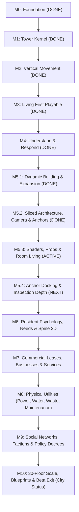

# Roadmap — One Roof

## Overview & Vision Boundary

One Roof is a vertical-city simulation where the player shapes architecture, infrastructure, leases, and policy while autonomous residents form routines, relationships, businesses, and factions ([Docs/01_GAME_VISION.md](file:///home/geisha/Vibecode/UnityAI/one-roof/Docs/01_GAME_VISION.md)).

- **First Proof (Milestones 0–4):** Five floors, 50 persistent residents, observable elevator congestion, explainable wait overlay, second-elevator capacity intervention, and golden acceptance verification. *(STATUS: COMPLETE)*
- **Interactive Expansion (Milestone 5):** Dynamic slab/room construction, economy treasury, demand-driven leasing, bulldozer demolition, stairwells, 9-sliced room backdrops, interactive camera navigation, environment prop families, holographic build shaders, and resident room living. *(STATUS: ACTIVE)*
- **Beta Boundary (Milestone 10):** 30 floors, 300 persistent residents, full room diversity (residential, office, retail, clinic, maintenance, security, utility), physical utilities (power, water, waste), resident needs, 4 faction archetypes, policy decrees, 8 data overlays, 6 crisis event chains, and sustaining **City Status** under strict performance budgets (<4ms simulation tick, 60 FPS presentation).

---

## Milestone Track

---

## Completed Milestones (M0 – M5.2)

### M0 — Repository and Project Foundation *(DONE)*
- Platform: Premium single-player desktop (Unity 6000.3.24f1 LTS, URP, GitHub VCS).
- Project imports cleanly with approved packages (Addressables 4.0.1, 2D Animation 13.0.6).
- Strict assembly definitions enforcing pure Domain (`OneRoof.Domain`), Application, Infrastructure, Presentation, Content, and Editor boundaries.

### M1 — Tower Kernel *(DONE)*
- Discrete 1D cell bounds, floors, rooms, and typed portals.
- Command-driven topology mutations emitting domain events.
- Versioned root save envelope (`SaveEnvelope`) with atomic file writes and schema migration tests.

### M2 — Vertical Movement Proof *(DONE)*
- Unified hierarchical transit graph connecting floor walk edges and vertical elevator shaft edges.
- Multi-car elevator bank state machine with FIFO floor queuing, boarding, capacity, travel, and door cycles.
- Wait time and congestion projection service calculating severity tiers.

### M3 — Living First Playable *(DONE)*
- 50 persistent residents across 16 households in canonical five-floor topology (`FiftyResidentFixture`).
- Daily routine schedule engine generating morning commute demand.
- `NpcViewPool` binding up to 40 pooled visible GameObjects to resident projections via `NpcVisibilityPolicy`.

### M4 — Understand and Respond *(DONE)*
- Command-driven Mode Shell Session managing Build, Inspect, and Data modes.
- Accessible elevator-wait flow overlay exposing the symptom-cause-response chain.
- Deterministic elevator placement predictor estimating throughput deltas and wait reductions before construction.
- Golden first-playable acceptance test: second elevator reduces wait times by >40%.

### M5.1 — Dynamic Expansion, Master Simulation & Persistence *(DONE)*
- Command-driven runtime slab construction, room zoning, and dynamic transit graph synchronization.
- Master `TowerSimulation` and `TransitExecutionSystem` coordinating discrete leg-by-leg movement without managed allocations.
- Tower treasury and demand-driven autonomous leasing system.
- Comprehensive save/load envelope preserving topology, economy, residents, and in-flight commute queues.
- Interactive build grid raycasting and color-coded placement ghost.
- Golden expansion acceptance test verifying dynamic 6th-floor construction and persistence.

### M5.2 — Spatial Construction, Architectural Dressing & Interaction Anchors *(DONE)*
- Bulldozer demolition tool with safety validation, 50% salvage refunds, and graph reclamation (`OR-511`).
- 2-cell Stairwell transit construction spanning adjacent floors with walkable vertical edges (`OR-512`).
- 8-cell Workplace / Corporate Office zoning with workforce capacity and leasing integration (`OR-513`).
- 9-Sliced room backdrop contract and presenter auto-expanding across 1–8 cells without distortion (`OR-514`, `ART-001`).
- Smooth interactive camera pan (WASD/middle drag), scroll zoom, and overview clamping (`OR-515`).
- Domain `InteractionPoint` schema (`Seat`, `Sleep`, `Cook`, `Work`, `Browse`) tracking anchor capacity and occupancy (`OR-516`).

---

## Active & Upcoming Milestones

### M5.3 — Shaders, Environment Props & Resident Room Living *(ACTIVE)*
**Goal:** Complete room furnishings, visual GPU shader transitions, and enable residents to live inside their rooms with full corridor-to-elevator transit.

- [x] **`ART-002`**: 16-prop environment sheet normalized with collision/interaction anchors; `PropContentRegistry`, `PropCatalog`, and `RoomFurnishingPresenter` dynamically furnishing Residential, Diner, Office, and Lobby rooms.
- [x] **`OR-517`**: AllIn1SpriteShader holographic placement ghost with animated scanlines, validity response, and procedural border textures.
- [x] **`OR-521`**: Resident room living: Residents positioned inside assigned apartments/rooms with interior slot spacing; leg-by-leg corridor walking, floor-specific elevator queues, and in-cabin riding.
- [ ] **`OR-518`**: Inspect mode selection and hover outline shader presenter (`OUTBASE_ON`, `GLOW_ON`) for pixel-perfect silhouettes on hovered/selected entities.
- [ ] **`OR-519`**: Demolition dissolve and construction scanline shader transitions (`FADE_ON` / `DISSOLVE_ON`) when bulldozing or building rooms/slabs.
- [ ] **`OR-520`**: Elevator congestion and resident agitation visual shader aura on doors and waiting commuters when wait times exceed thresholds.

**Exit Criteria:** All 16 props furnished, holographic ghost and shader outlines operational, zero primitives in scene, residents live inside rooms and walk transit legs, and tests pass cleanly.

---

### M5.4 — Furniture Anchor Docking & Inspection Depth *(PLANNED)*
**Goal:** Deepen physical room legibility and provide comprehensive inspection drill-downs into residents, rooms, and elevator shafts.

- **`OR-522` (Presentation Furniture Anchor Docking):** Connect resident visual views directly to `InteractionPoint` furniture positions so residents visibly sit on sofas, sleep in beds, work at desks, and dine at booths.
- **`OR-523` (Inspect Mode Deep Cards):**
  - **Resident Card:** Name, household, profession, daily routine timeline, current need levels, mood, home/workplace links, and follow-camera toggle.
  - **Room Card:** Content type, tenant household or business, capacity/occupants, rent tier, and condition.
  - **Elevator Card:** Current floor, direction, speed, passenger manifest, wait queue breakdown, and maintenance wear.

**Exit Criteria:** Residents visibly dock onto furniture anchors; clicking any resident, room, or elevator shaft in Inspect mode opens a data-rich inspector card with complete symptom/cause breakdown.

---

### M6 — Living Society, Resident Psychology & Character Pipeline *(PLANNED)*
**Goal:** Replace static schedule transitions with dynamic resident needs, psychology, satisfaction, and fluid 2D skeletal character animation.

- **`ART-003` (Milestone 6.0 — Spine 2D Skeletal Animation & Wardrobe Compositor):**
  - Shared 17-bone humanoid rig (`rig.npc.humanoid.2d.v1`).
  - 6 core animation clips: `idle-breathe`, `walk-stride`, `queue-wait`, `elevator-ride`, `chair-sit`, `desk-work` / `meal-eat`.
  - 8-layer modular wardrobe compositor: body, face, hair, lower clothing, upper clothing, footwear, accessory, carried prop.
  - Household affiliation color palettes.
- **`OR-601` (Milestone 6.1 — Resident Needs & Autonomous Schedule Arbitration):**
  - Five core needs: **Hunger**, **Energy/Rest**, **Social**, **Hygiene**, **Purpose**.
  - Dynamic destination decision-making: Hungry residents seek diners; exhausted residents return home to sleep; social residents seek lounges or skylobbies.
- **`OR-602` (Milestone 6.2 — Satisfaction Scoring, Grievances & Satisfaction Overlay):**
  - Satisfaction calculated from commute wait friction, noise, crowding, need deprivation, and rent burden.
  - Grievance accumulation: Persistent dissatisfaction leads to tenant complaints, withholding rent, and eventual move-out.
  - **Overlay 4: Satisfaction Overlay** displaying green-to-red contentment across tower zones.
- **`OR-603` (Milestone 6.2 — Population Density & Demographics Overlay):**
  - **Overlay 3: Population Overlay** visualizing resident density and income/age demographics.
- **`ART-004` (Milestone 6.1 — AssetLab Validation Tooling & Addressables):**
  - Automated seam testing runner, rig validation, and Addressables bundle packaging.

**Exit Criteria:** Residents autonomously resolve needs; dissatisfaction generates grievances; Spine 2D animated characters replace static sprites; Satisfaction and Population overlays operational.

---

### M7 — Commercial Economy, Leases & Service Rooms *(PLANNED)*
**Goal:** Expand tower zoning beyond basic apartments and diner into an interconnected commercial ecosystem where businesses lease space, hire residents, and serve customers.

- **`OR-701` (Expanded Room Zoning & Content):**
  - **Retail Shops:** Corner grocery, clothing boutique, bookshop.
  - **Civic & Health:** Medical clinic, pharmacy.
  - **Operations:** Maintenance workshop, security station.
- **`OR-702` (Commercial Lease Lifecycle & Employment Matching):**
  - Commercial leases: Base rent + revenue share, foot traffic requirements, operational expenses.
  - Local hiring: Businesses recruit resident workers matching skill/proximity; employee wage payouts fund household budgets.
  - Solvency & bankruptcy: Low customer traffic or high transit congestion causes business insolvency and lease default.
- **`OR-703` (Business Health & Foot Traffic Overlays):**
  - **Overlay 1: Foot Traffic Flow Overlay** showing pedestrian transit vectors and commute density.
  - **Overlay 6: Business Health Overlay** highlighting solvent vs. struggling commercial tenants.

**Exit Criteria:** 4+ distinct commercial room types functional; residents work at tower shops and receive wages; foot traffic drives business solvency; Foot Traffic and Business Health overlays operational.

---

### M8 — Physical Utilities (Power, Water, Waste & Maintenance) *(PLANNED)*
**Goal:** Introduce physical utility networks that create engineering constraints on building height and require active maintenance management.

- **`OR-801` (Electrical Grid Network):**
  - Ground intake substation, vertical electrical riser ducts, floor transformer boxes.
  - Voltage drop across height; overloaded transformers cause localized blackouts and brownouts.
- **`OR-802` (Plumbing & Gravity Waste Networks):**
  - Municipal water intake, ground pressure pumps, booster pumps required every 8 floors for adequate pressure.
  - Gravity trash chutes, basement compactors, waste accumulation when service is interrupted.
- **`OR-803` (Infrastructure Wear, Technician Jobs & Utilities Overlay):**
  - Equipment wear over time; maintenance technicians dispatched from workshops to repair aging infrastructure.
  - Failure chains: Power outage halts elevator banks; water outage closes diners/clinics.
  - **Overlay 8: Utilities Flow & Pressure Overlay** visualizing power load, water pressure head, and waste capacity.

**Exit Criteria:** Power, water, and waste flow through vertical shafts; height creates pressure/voltage drop; brownouts disable elevators; maintenance technicians service equipment; Utilities overlay operational.

---

### M9 — Social Fabric, Factions & Policy Decrees *(PLANNED)*
**Goal:** Simulate emergent social dynamics where residents form relationships, organize into factions, and respond to player policies.

- **`OR-901` (Relationship Graph & 4 Faction Archetypes):**
  - Affinity formation: Residents build friendships through shared workplaces, neighboring apartments, and elevator encounters.
  - Four distinct factions ([Docs/01_GAME_VISION.md](file:///home/geisha/Vibecode/UnityAI/one-roof/Docs/01_GAME_VISION.md)):
    1. **Tenant Union:** Residential working class focused on affordable rent, elevator speed, and living conditions.
    2. **Corporate Coalition:** Commercial office executives demanding reliable power, priority transit, and high-income amenities.
    3. **Merchant Guild:** Retail and restaurant owners focused on customer foot traffic and low commercial tax.
    4. **Civic & Eco Council:** Environmentalists demanding low waste, noise control, and green public spaces.
- **`OR-902` (Manage Mode: Steward Policy & Decree Panel):**
  - Player enacts policies: Rent caps, transit subsidies, quiet hours, express elevator lanes, commercial tax adjustments.
  - Faction approval reacts to policies and living standards.
- **`OR-903` (Faction Tension & Noise Overlays / Civil Actions):**
  - **Overlay 5: Noise Overlay** displaying acoustic bleed from elevators, workshops, and diners into residential units.
  - **Overlay 7: Faction Tension Overlay** exposing regional dissatisfaction hot-spots.
  - Faction civil actions: Rent strikes, lobby protests, work slowdowns.

**Exit Criteria:** 4 factions form and track member allegiance; Steward decree panel functional; policy changes alter faction relations; protests/strikes occur upon severe tension; Noise and Faction Tension overlays operational.

---

### M10 — Tower Scaling, Blueprints & Beta Exit (City Status) *(PLANNED)*
**Goal:** Scale the simulation to the full Beta Boundary (30 floors, 300 persistent residents) with scaling tools, crisis event chains, and campaign progression.

- **`OR-1001` (Blueprints & Rapid Expansion Tooling):**
  - Floor copy/paste blueprints, multi-room zoning templates, and slab batch construction.
  - Performance budgets enforced: 300 persistent entities, 60 pooled visible views, <4ms tick budget, 60 FPS presentation.
- **`OR-1002` (Six Dynamic Crisis Event Chains):**
  - Multi-stage event chains testing player response:
    1. *Elevator Cable Failure:* Major shaft outage requiring emergency stairs and evacuation.
    2. *Electrical Substation Fire:* Cascading blackout shutting down pumps and lights.
    3. *Summer Heatwave:* HVAC overload causing extreme resident agitation.
    4. *Viral Outbreak:* Contagion spreading through crowded elevator cabs, requiring clinic quarantine.
    5. *Transit Workers Strike:* Walkout halting elevator operations unless union demands are met.
    6. *City Safety Inspection:* Municipal audit evaluating building code compliance, fire exits, and utility reserves.
- **`OR-1003` (Beta Boundary Golden Acceptance Test):**
  - Campaign goal: Achieve and sustain **City Status** for 30 in-game days.
  - Full five-point explanation chain verified for every crisis: Symptom → Overlay → Inspector → Player Response → Measurable Outcome.
  - Complete release-like profiling and handoff documentation.
- **`ART-005` (Milestone 6.2 — Audio Soundscapes & Environmental Atmosphere):**
  - Surface-reactive corridor footsteps, elevator mechanical foley, roomtones, and volumetric window lighting.

**Exit Criteria:** 30 floors and 300 persistent residents running deterministically; all 8 overlays and 6 event chains operational; City Status achieved; performance budgets verified on reference hardware.

---

## Complete Overlay Registry (8 Beta Overlays)

| # | Overlay | Primary Visual Channel | Data Source | Corresponding Crisis / Cause |
| --- | --- | --- | --- | --- |
| 1 | **Elevator Wait** *(DONE)* | Animated flow paths & queue bars | `ElevatorBankCongestionProjection` | Shaft capacity shortage, floor bottlenecks |
| 2 | **Foot Traffic** | Directional vector paths | `HierarchicalTransitGraph` | Corridor choke-points, stairwell demand |
| 3 | **Population** | Density gradient & demographic glyphs | `PopulationState` | Overcrowding, demographic segregation |
| 4 | **Satisfaction** | Soft regional glow (emerald → ruby) | `SatisfactionService` | Commute friction, need deprivation, high rent |
| 5 | **Noise** | Acoustic wave contours | `AcousticPropagationService` | Workshop/diner noise bleeding into bedrooms |
| 6 | **Business Health** | Solvency badges (green / amber / red) | `BusinessAccountingSystem` | Foot traffic failure, excessive commercial rent |
| 7 | **Faction Tension** | Regional tension contour map | `FactionState` | Policy grievances, strike and protest risk |
| 8 | **Utilities** | Network pipe/cable flow pressure | `UtilityNetworkGraph` | Overloaded transformers, low water pressure |

---

## Non-Negotiable Engineering Standards

1. **Domain Purity:** `OneRoof.Domain` remains pure C# with 0 `UnityEngine` references; domain tests run without loading Unity scenes.
2. **Snapshot Projection Rule:** Presentation and UI consume read-only immutable snapshots; UI never bypasses commands to mutate simulation records.
3. **No Per-Agent Update Loops:** Zero `Update()` loops on individual resident GameObjects; simulation executes in a fixed tick pipeline.
4. **Performance Budgets (30-Floor Beta Boundary):**
   - Visible NPC views: Capped at 60 active pooled views.
   - Simulation tick: p95 below 4.0 ms.
   - Draw calls: < 120 draw calls via texture atlasing and GPU instancing.
   - Texture memory: < 180 MB uncompressed.
   - Presentation: Stable 60 FPS on reference desktop hardware.
5. **Validation & Handoff Rule:** Every milestone and task must exit with reproducible tests, 100% `.meta` hygiene, and an active handoff document in `Handoffs/Active/`.
